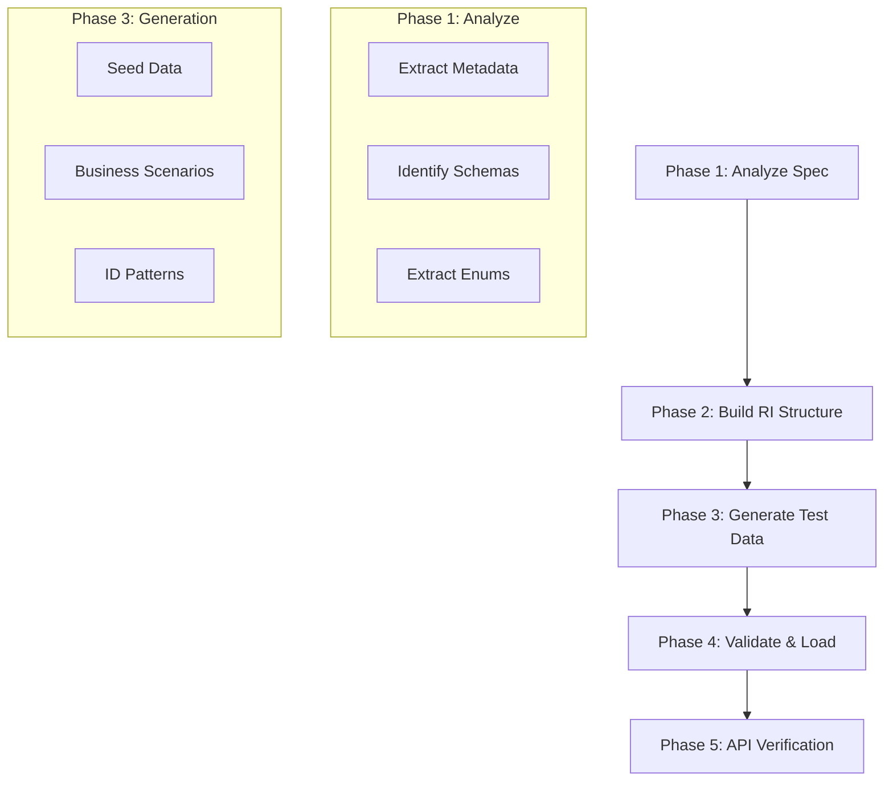

# TMF Test Data & Reference Implementation Generator Skill

Automates the creation of TM Forum OpenAPI Reference Implementations (RI) and generates comprehensive, business-focused test data and scenarios from OpenAPI specs and PDF documentation.

## When to Use

When you receive a new TM Forum OpenAPI spec (e.g., TMF621, TMF628, TMF724) and need to:
- **Build a Reference Implementation**: Create a working Node.js/Express/MongoDB REST API.
- **Parse OpenAPI Specs**: Automatically extract schemas, enums, paths, and constraints.
- **Generate Test Data**: Create valid JSON seed files matching the schema.
- **Create Scenarios**: Develop business-focused test cases (e.g., network outages, congestion hotspots).
- **Validate & Load**: Verify data against spec constraints and load into MongoDB via Docker.

## Quick Start

```bash
# 1. Generate core RI structure and test data
cd test-mock-servers/tmf{xxx}-{version}
node scripts/generate-testdata.js \
  --spec openapi/*.yaml \
  --output testdata/ \
  --scenarios 5

# 2. Build and start the environment
docker compose up -d --build

# 3. Load test data into MongoDB
for f in testdata/*.json; do
  col=$(basename "$f" .json)
  docker exec -i tmf{xxx}-mongo mongoimport \
    --db tmf{xxx} \
    --collection "$col" \
    --jsonArray < "$f"
done
```

## Workflow



### Phase 1: Analyze the Spec
Examine the Swagger/OpenAPI spec to identify resources, paths, and field constraints.
```bash
cat openapi/*.json | jq '.definitions | keys'
```

### Phase 2: Project Structure
Create the standard TM Forum RI structure:
```
{tmf-folder}/
├── index.js              # Express entry point
├── Dockerfile            # Container config
├── docker-compose.yml    # App + MongoDB stack
├── openapi/              # Spec files (*.yaml or *.json)
├── scripts/              # Generation & seed scripts
├── testdata/             # Generated JSON & Scenarios
└── src/
    ├── controllers/      # CRUD handlers
    ├── models/           # Mongoose/DB schemas
    └── routes/           # API endpoints
```

### Phase 3: Generate Test Data
Use `scripts/generate-testdata.js` to create realistic records.
- **Seed Data**: Baseline entities for each resource.
- **Scenarios**: Combined records for specific use cases (e.g., "Critical Outage").

### Phase 4: Validate and Load
Verify data against enums and load into the running container.
```bash
# Validate
node scripts/validate-data.js openapi/spec.yaml testdata/

# Load via Docker
docker exec -i tmf-mongo mongoimport --db tmf --collection resource --jsonArray < testdata/resource.json
```

## ID Generation Patterns

| Resource Type | Pattern | Example |
|--------------|---------|---------|
| Trouble Ticket | `TT-{TYPE}-{SEVERITY}-{DATE}` | `TT-INC-CRIT-20260201` |
| Performance | `pm-{location}-{count}` | `pm-dublin-001` |
| Service | `SRV-{REGION}-{NUM}` | `SRV-DUB-001` |
| Generic | `{PREFIX}-{UUID}` | `ABC-12345abc` |

## Directory Structure (Standard)

```
test-mock-servers/tmf{xxx}/
├── skills/
│   └── tmf-openapi-ri/
│       └── SKILL.md
├── testdata/
│   ├── {resource}.json           # Seed data
│   ├── scenario-{name}.json      # Business scenario
│   └── SCENARIOS.md              # Scenario documentation
└── scripts/
    ├── generate-testdata.js      # Generator logic
    └── validate-data.js          # Schema validator
```

## Common Issues

| Issue | Solution |
|-------|----------|
| Invalid enum value | Run `validate-data.js` to check against OpenAPI spec |
| MongoDB connection | Ensure `DB_URL` uses the container service name (e.g., `mongodb://mongo:27017`) |
| ID Conflicts | Use unique timestamp-based or counter-based ID patterns |
| `mongoimport` Error | Ensure JSON is a valid array; use `--jsonArray` flag |

## Verification Checklist

- [x] OpenAPI spec parsed (Metadata/Schemas/Enums)
- [x] RI Structure created with Express/MongoDB
- [x] Seed data generated per resource
- [x] Business scenario files created in `testdata/`
- [x] All JSON syntax validated
- [x] Data loaded successfully via `mongoimport`
- [x] API endpoints returning correct data

---
**Last Updated:** 2026-02-02
**Skill Version:** 1.2.0
